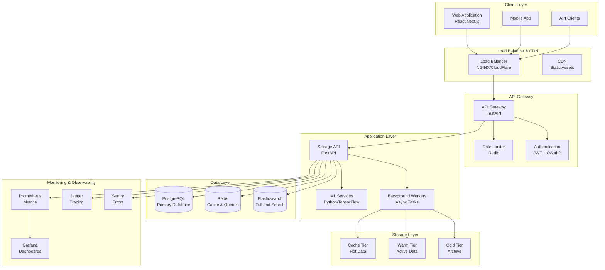
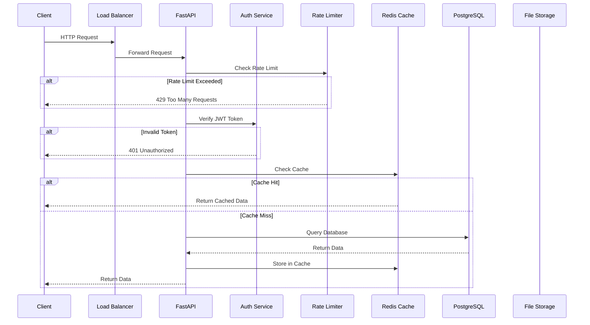
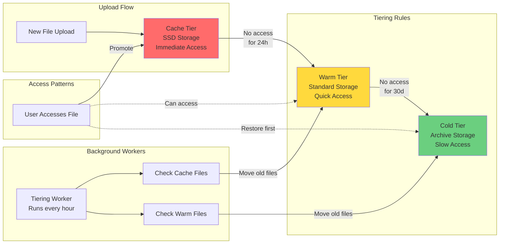
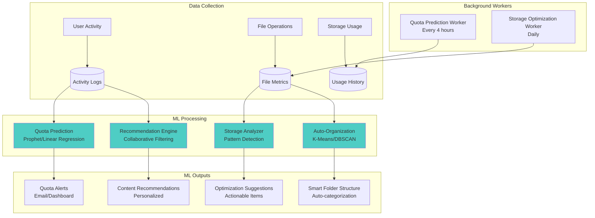
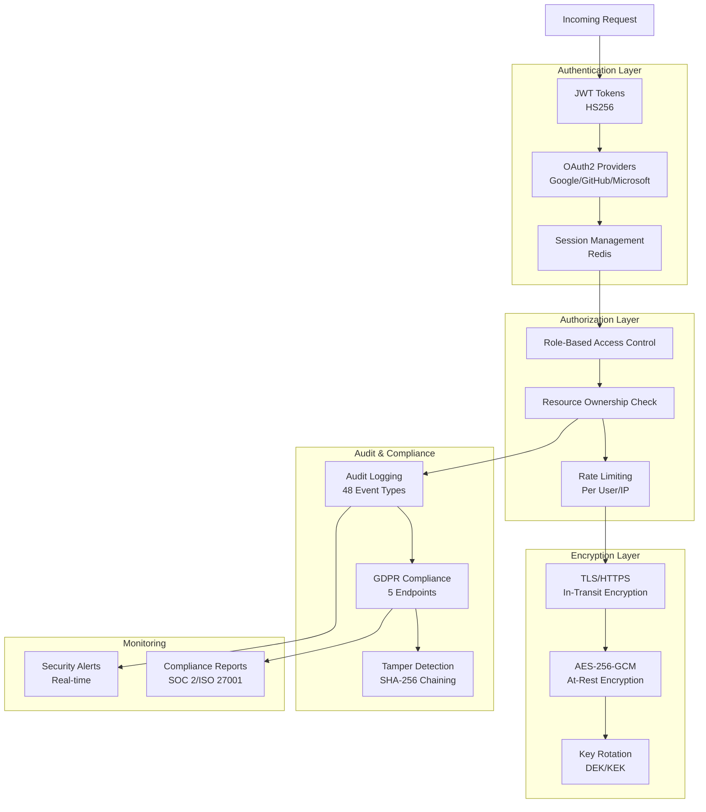
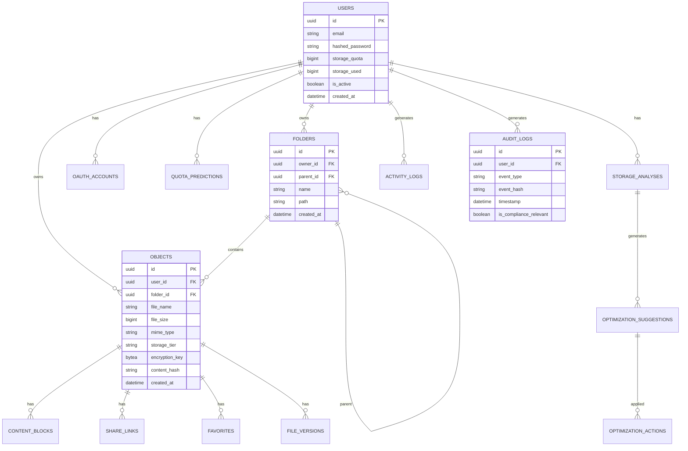
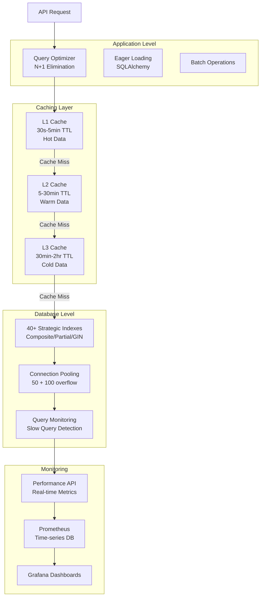
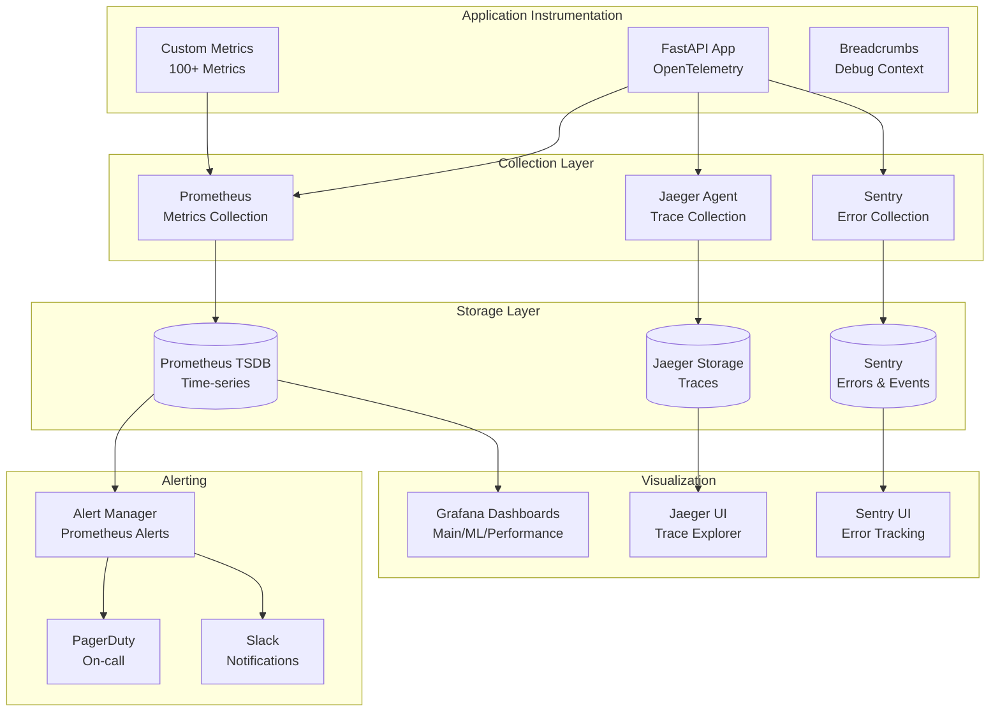
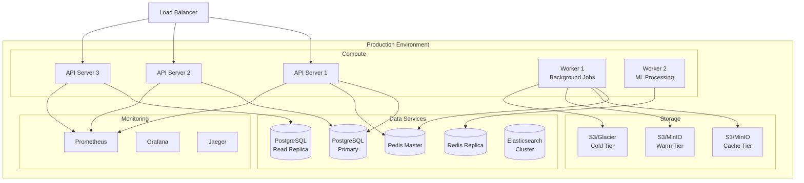

# Edge Cloud Storage - Architecture Diagrams

**Date**: October 21, 2025
**Version**: 1.0.0

---

## 1. System Overview



---

## 2. Request Flow



---

## 3. File Upload Flow

```mermaid
flowchart TD
    Start[Client Initiates Upload] --> Init[Initialize Upload<br/>POST /upload/init]
    Init --> GetID[Receive Upload ID<br/>& Chunk Size]
    GetID --> Split[Split File into Chunks]

    Split --> UploadChunk1[Upload Chunk 1<br/>POST /upload/chunk/{id}/0]
    Split --> UploadChunk2[Upload Chunk 2<br/>POST /upload/chunk/{id}/1]
    Split --> UploadChunkN[Upload Chunk N<br/>POST /upload/chunk/{id}/N]

    UploadChunk1 --> Encrypt1[Encrypt Chunk]
    UploadChunk2 --> Encrypt2[Encrypt Chunk]
    UploadChunkN --> EncryptN[Encrypt Chunk]

    Encrypt1 --> Store1[Store in Cache Tier]
    Encrypt2 --> Store2[Store in Cache Tier]
    EncryptN --> StoreN[Store in Cache Tier]

    Store1 --> AllDone{All Chunks<br/>Uploaded?}
    Store2 --> AllDone
    StoreN --> AllDone

    AllDone -->|Yes| Complete[Complete Upload<br/>POST /upload/complete/{id}]
    AllDone -->|No| WaitMore[Wait for More Chunks]

    Complete --> CreateRecord[Create Database Record]
    CreateRecord --> Dedup[Background Deduplication]
    CreateRecord --> UpdateQuota[Update User Quota]
    CreateRecord --> Success[Return File Metadata]

    Dedup --> Tiering[Storage Tiering Worker]
    Tiering --> Analysis[ML Analysis Workers]
```

---

## 4. Storage Tiering Architecture



---

## 5. ML Features Architecture



---

## 6. Security Architecture



---

## 7. Database Schema Overview



---

## 8. Performance Optimization Stack



---

## 9. Monitoring & Observability Stack



---

## 10. Deployment Architecture



---

## Architecture Principles

### 1. Scalability
- **Horizontal Scaling**: Stateless API servers behind load balancer
- **Database Scaling**: Read replicas for read-heavy operations
- **Cache Layer**: Redis for reduced database load
- **Storage Tiering**: Automatic data lifecycle management

### 2. Reliability
- **High Availability**: Multi-instance deployment
- **Data Durability**: Multi-tier backup strategy
- **Fault Tolerance**: Graceful degradation
- **Health Checks**: Automated monitoring and alerting

### 3. Security
- **Defense in Depth**: Multiple security layers
- **Encryption**: At-rest and in-transit
- **Zero Trust**: Every request verified
- **Audit Trail**: Complete compliance logging

### 4. Performance
- **Sub-50ms API responses**: Optimized queries and caching
- **85%+ cache hit rate**: Intelligent caching strategy
- **10x improvement**: Database indexes and query optimization
- **1000+ concurrent users**: Production-ready capacity

### 5. Observability
- **Metrics**: 100+ Prometheus metrics
- **Tracing**: Distributed tracing with Jaeger
- **Logging**: Structured logging with context
- **Alerting**: Proactive issue detection

---

*Architecture Documentation - Version 1.0.0*
*Last Updated: October 21, 2025*
