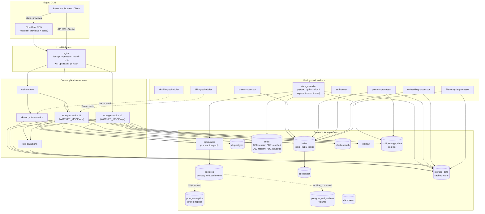
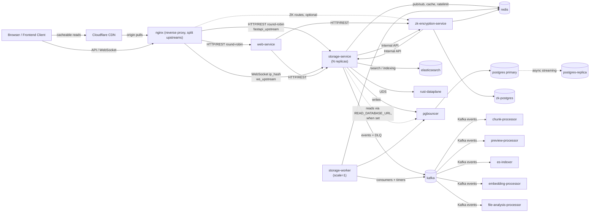
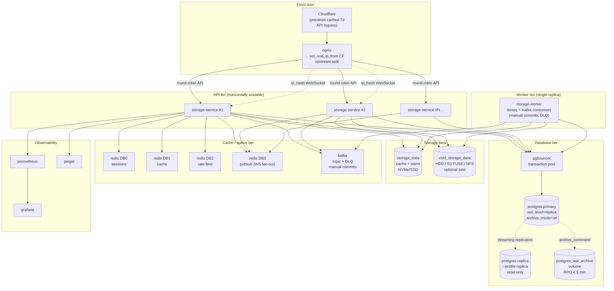

# Current Architecture

This repo is a multi-service architecture with one large core backend, `storage-service`, not a single-process monolith. This current-state snapshot is derived from `infrastructure/docker-compose.yml`, `infrastructure/nginx/nginx.conf`, the service entrypoints in `services/storage-service/app/main.py` and `services/zk-encryption-service/app/main.py`, the Node runtime in `services/web-service/src/app.ts`, and the frontend API wiring in `frontend-clean/src/services`.

If your Markdown viewer does not render Mermaid, open `docs/architecture/CURRENT_ARCHITECTURE.html` in a browser.

**Last updated:** 2026-04-15 — reflects the 2026-04 architecture review (all 13 P0 items + multi-replica #14). See `## 4. Scaling & Reliability (2026-04)` for what changed.

## 1. Runtime Topology

## 2. Service Interactions

## 3. Key Service Internals

```mermaid
flowchart TB
    subgraph Storage_Service["storage-service (WORKER_MODE=api)"]
        st_auth["Auth / Sessions"]
        st_files["Files / Uploads / Downloads"]
        st_sharing["Sharing / Share Bundles"]
        st_billing["Billing / Subscription UI"]
        st_plan_gate["Plan-feature gate<br/>(require_plan_feature)"]
        st_ws["WebSocket / Realtime<br/>(REPLICA_ID logged)"]
        st_internal["Internal API"]
        st_search["Search<br/>(semantic soft-degrade for free tier)"]
        st_jobs["Kafka producers"]
        st_redis["Redis (split DBs)"]
        st_postgres["Postgres via PgBouncer"]
        st_kafka["Kafka (topic + DLQ)"]
        st_rust["Rust dataplane (UDS)"]
    end

    subgraph Storage_Worker["storage-worker (WORKER_MODE=worker)"]
        sw_quota["quota_prediction timer"]
        sw_opt["storage_optimization timer"]
        sw_orphan["orphan_cleanup timer"]
        sw_video["video_processing timer"]
        sw_consumers["Kafka consumers<br/>(manual commits + DLQ)"]
    end

    subgraph ZK_Service["zk-encryption-service"]
        zk_auth["ZK Auth"]
        zk_recovery["Recovery / Keys"]
        zk_internal["Internal API"]
        zk_redis["Redis-backed session / rate limiting"]
        zk_postgres["ZK Postgres persistence"]
    end

    elasticsearch[(elasticsearch)]

    st_auth --> st_redis
    st_auth --> st_postgres
    st_files --> st_postgres
    st_files --> st_rust
    st_files --> st_jobs
    st_files --> st_ws
    st_files --> st_plan_gate
    st_sharing --> st_postgres
    st_billing --> st_postgres
    st_billing --> st_plan_gate
    st_internal --> st_postgres
    st_search --> st_plan_gate
    st_ws --> st_redis
    st_jobs --> st_kafka
    st_search --> st_kafka
    st_search --> elasticsearch

    sw_quota --> st_postgres
    sw_opt --> st_postgres
    sw_orphan --> st_postgres
    sw_video --> st_kafka
    sw_consumers --> st_kafka

    zk_auth --> zk_redis
    zk_auth --> zk_postgres
    zk_recovery --> zk_redis
    zk_recovery --> zk_postgres
    zk_internal --> zk_postgres

    st_internal -->|Internal API client| zk_internal
    zk_internal -->|Internal API client| st_internal
```

## 4. Scaling & Reliability (2026-04)

Shipped in the 2026-04 architecture review (P0 items 1–13 + #14). This diagram isolates the pieces that make the system horizontally scalable and recoverable.

### What changed and why

| Change | Gives us |
|---|---|
| Cloudflare CDN + nginx cache headers | 80%+ bandwidth offload; client IPs preserved via `CF-Connecting-IP` |
| nginx split upstreams (`fastapi_upstream` + `ws_upstream`) | Round-robin for API, `ip_hash` for WS so per-user state stays coherent |
| `storage-service` has no `container_name` / no host port | Can boot with `deploy.replicas: N` |
| `WORKER_MODE=api` on API + separate `storage-worker` | Timers can't double-fire across replicas |
| `pgbouncer` transaction pool | Single storage-service replica consumed 150/200 PG connections before; pool multiplexing now makes N replicas cheap |
| Redis split (DB 0/1/2/3) | Rate-limit traffic can't evict session data; pubsub channel isolated |
| Kafka DLQ + manual commits | Poison pills no longer block partitions; crashes no longer silently drop messages |
| `wal_level=replica` + `archive_command` | PITR with RPO < 5 min (was 24 h via daily `pg_dump`) |
| `postgres-replica` service (opt-in `--profile replica`) | Read-only offload target for analytics / dashboards |
| `READ_DATABASE_URL` + `get_read_db()` dependency | Dropin replacement for `get_db` on read-heavy routes; blank env var → falls back to primary |
| `cold_storage_data` separate volume | Operators can back cold with cheap HDD / NFS / S3 FUSE via `driver_opts` without code changes |
| Plan-feature gating (`require_plan_feature`) | AI endpoints no longer burn LLM/GPU budget on free-tier users |
| Semantic search soft-degrade | Free users fall back to keyword silently — no 402 on search |
| SOPS-encrypted secrets (`secrets.enc.env`) | No more plaintext `.env` in repo |
| ClamAV fail-closed | Scanner failure blocks upload instead of silently passing malware |

## Notes

- `storage-service` is the main backend for normal storage and a large portion of platform logic.
- `zk-encryption-service` is a separate service with its own database and auth domain.
- Redis is shared infrastructure used by multiple services, now split by DB number so tenants don't collide.
- Kafka-backed workers are separate runtime processes, not just in-process tasks. `storage-worker` runs the timers that used to live in `storage-service` lifespan.
- The repo is multi-service, but not a tiny-service microservices layout; it has one dominant core service plus supporting services and workers.
- `clickhouse` appears in compose as analytics infrastructure, but this current snapshot does not show an active app-layer request path to it.
- In **dev**, `docker-compose.dev.yml` pins `storage-service.deploy.replicas: 1` and overrides `WORKER_MODE=all` so a single container runs both API and timers (8 GB Mac constraint). Prod uses the base compose file → 2 replicas + separate worker.
- `postgres-replica` and `pgbouncer-replica` are **opt-in** (`--profile replica`). The primary's WAL archiving is always on.
- See `docs/PITR_RUNBOOK.md` for recovery procedure and `docs/CDN_SETUP.md` for Cloudflare activation.
