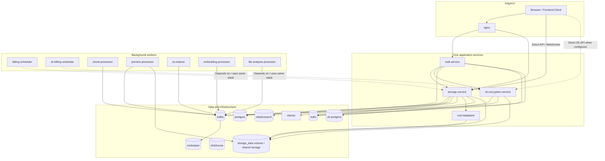
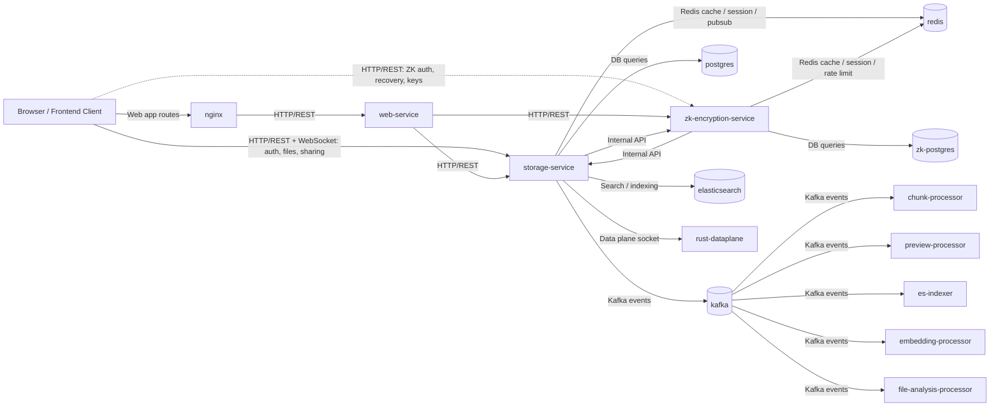
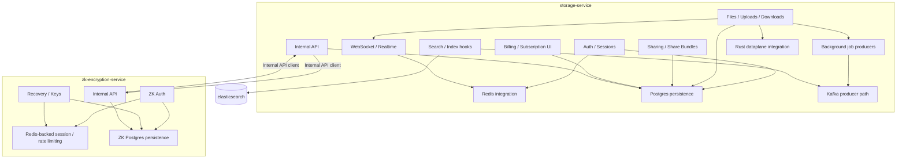

# Current Architecture

This repo is a multi-service architecture with one large core backend, `storage-service`, not a single-process monolith. This current-state snapshot is derived from `infrastructure/docker-compose.yml`, the service entrypoints in `services/storage-service/app/main.py` and `services/zk-encryption-service/app/main.py`, the Node runtime in `services/web-service/src/app.ts`, and the frontend API wiring in `frontend-clean/src/services`.

If your Markdown viewer does not render Mermaid, open `docs/architecture/CURRENT_ARCHITECTURE.html` in a browser.

## 1. Runtime Topology

## 2. Service Interactions

## 3. Key Service Internals

## Notes

- `storage-service` is the main backend for normal storage and a large portion of platform logic.
- `zk-encryption-service` is a separate service with its own database and auth domain.
- Redis is shared infrastructure used by multiple services.
- Kafka-backed workers are separate runtime processes, not just in-process tasks.
- The repo is multi-service, but not a tiny-service microservices layout; it has one dominant core service plus supporting services and workers.
- `clickhouse` appears in compose as analytics infrastructure, but this current snapshot does not show an active app-layer request path to it.
- `storage-service` also starts some in-process background services from its FastAPI lifecycle, in addition to the separate worker containers shown above.
